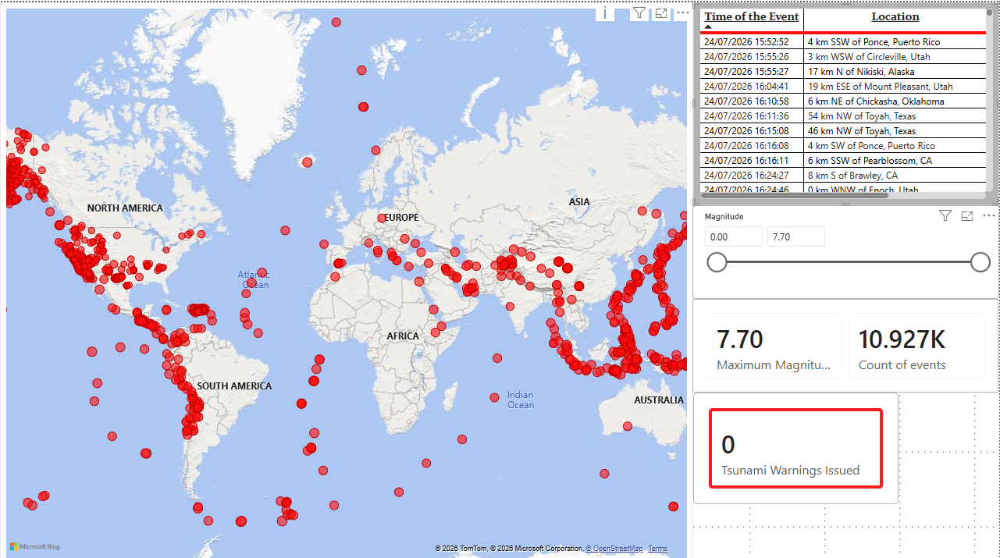

# 🌍 Earthquake Seismic Tracker

A small pipeline that quietly watches the planet shake, all day, every day, and turns a rolling month of real seismic activity into a Power BI report you can actually make sense of at a glance.

## Preview

Every red dot is a real earthquake from the last 30 days — you can see the Pacific Ring of Fire trace itself out just from where the dots cluster. The panel on the right is the same data as a browsable table, a magnitude slicer, and a couple of summary cards (max magnitude, total event count, tsunami warnings).

## What this is, and why it exists

This is the sibling project to [`tracking_metals`](../tracking_metals) — same basic idea, different signal. That one watches commodity prices and geopolitical tension; this one watches earthquakes. Magnitude, depth, location, tsunami risk, all sourced straight from the USGS, all collected on autopilot in the background while you do literally anything else.

There isn't a grand analytical thesis behind it beyond "build a real, live pipeline end to end and watch something true happen on a map." That said, a clean magnitude/depth/location dataset like this is a decent foundation if the itch to go further ever comes back — clustering along known fault lines, checking whether bigger quakes correlate with tsunami alerts, that kind of thing. For now it's a working pipeline and a report that looks genuinely good, which was the actual goal.

## How the pipeline works, today

Every 15 minutes, a script on this machine hits the USGS real-time earthquake feed, pulls down everything that's happened in roughly the last month, filters it down to actual tectonic earthquakes, and inserts anything new into a local PostgreSQL database. Power BI reads from that same database, and whenever you want an up-to-date view, you open the report and hit Refresh.

That's the whole loop. No servers to maintain, no cloud costs, nothing to babysit — it just runs.

**A bit more detail on how it stays reliable:**

- **The feed itself:** USGS publishes an `all_month.geojson` summary — a live, continuously-updated snapshot of the trailing ~30 days, already geocoded, free, no API key required, refreshed on their end roughly every minute. Pulling the whole month on every run (rather than just "what's new since last time") sounds wasteful, but it isn't really — the file's a few MB, USGS does all the heavy lifting server-side, and it means a missed run, a sleeping laptop, or a delayed cron tick can never cause a gap. Whatever happened while the machine was off just shows up whole the next time it runs.
- **No duplicates, ever:** every row is keyed on USGS's own event `id`, and inserts use `ON CONFLICT (event_id) DO NOTHING`. Re-running the script — on purpose, by accident, twice in a row — never creates a duplicate row and never overwrites what's already there.
- **A quirk worth knowing:** USGS revises magnitude and location for a while after an event as more seismic stations report in. Because inserts are insert-only, a row keeps whatever values it had when it was *first* seen, not later corrections. Rare that this matters for a dashboard like this, but if tracking those revisions ever becomes important, that's the place to change — swap the `ON CONFLICT DO NOTHING` for an `ON CONFLICT DO UPDATE`.
- **Filtering out the noise:** USGS's feed technically includes some non-earthquake seismic detections too — quarry blasts, explosions — under the same endpoint. Those get filtered out by `properties.type == "earthquake"` before anything touches the database.

## What each file actually is

| File | What it's for |
|---|---|
| `earthquake_tracker.py` | The whole pipeline in one script: fetch the USGS feed, filter to real earthquakes, insert new ones into Postgres. This is what Task Scheduler runs every 15 minutes. |
| `earthquake_tracker_visuals.pbix` | The Power BI report itself — a bubble map plus supporting tables, cards, and a magnitude slicer, all reading live from the local Postgres database. |
| `requirements.txt` | The two Python packages the script needs: `requests` (to call the USGS feed) and `psycopg2-binary` (to talk to Postgres). |
| `.github/workflows/earthquake_tracker.yml` | A GitHub Actions workflow that exists but is intentionally dormant — see "About that GitHub Actions file" below. |
| `register-earthquake-task.ps1` | The script that sets up the Windows Scheduled Task that actually drives everything. Not tracked in this repo (it's machine-specific), but described in full below so it can be recreated anywhere. |
| `earthquake_tracker.log` | Local run log — every fetch, every insert count, every error, timestamped. Not tracked in the repo either, purely a local debugging aid. |
| `earthquake_events.db` | A leftover from before this used Postgres — see below. Not part of the live pipeline anymore. |

## The data itself

Everything lands in a single table, `earthquake_events`, in the local `earthquake_tracker` Postgres database:

| Column | Where it comes from | Notes |
|---|---|---|
| `event_id` (primary key) | USGS's `id` | e.g. `us6000tkig` |
| `event_time` | `properties.time` | When the quake actually happened, converted from epoch milliseconds to a proper timestamp |
| `ingested_at` | — | When *this* pipeline first saw and stored the row |
| `place` | `properties.place` | Human-readable location, USGS's own description |
| `mag` | `properties.mag` | Magnitude — this is what drives bubble size on the map |
| `mag_type` | `properties.magType` | e.g. `mb`, `ml`, `mww` — the scale used to compute the magnitude |
| `depth_km` | `geometry.coordinates[2]` | How far below the surface |
| `lat` / `long` | `geometry.coordinates[1]` / `[0]` | Pre-geocoded by USGS, no extra work needed on this end |
| `significance` | `properties.sig` | USGS's own composite severity score (0–1000+) |
| `alert` | `properties.alert` | PAGER alert level — green / yellow / orange / red, or blank for most events |
| `tsunami` | `properties.tsunami` | 1 if a tsunami warning was associated with the event |
| `event_type` | `properties.type` | Always `earthquake` after filtering |
| `status` | `properties.status` | `reviewed` or `automatic`, USGS's own confidence label |
| `source_url` | `properties.url` | Direct link back to the USGS event page, handy for double-checking anything that looks surprising |

## Power BI

`earthquake_tracker_visuals.pbix` is a single-page report with a bubble map (`lat`/`long` for position, `mag` for bubble size, plus `place`, `depth_km`, and `event_time` in the tooltip), a table for browsing individual events, two summary cards, and a magnitude slicer for filtering the map down to whatever severity range you actually care about.

It connects straight to the local Postgres database, so getting a current view is just: open the file, hit Refresh. No `git pull` step is needed here the way it is for `tracking_metals` — there's no committed data file standing between the source and the report, Power BI talks to the live database directly. The one thing worth doing once, if it isn't already, is telling Power BI to remember the Postgres credentials (Power BI Desktop → File → Options and Settings → Data source settings) so Refresh never stalls on a login prompt.

## Scheduling — where the automation actually lives

This is the part that keeps the whole thing alive without you having to think about it: a Windows Scheduled Task named `EarthquakeTracker`, registered by running `register-earthquake-task.ps1` once. It fires every 15 minutes, runs `earthquake_tracker.py` in the background with no visible window (via `pythonw.exe`), and writes its own log rather than relying on the console. Re-running the registration script at any point just replaces the existing task with a fresh one — safe to do if the interval ever needs to change.

Two practical things worth knowing about it:
- It's registered under an **interactive logon**, meaning it only runs while you're actually logged into Windows. Log off and it pauses; log back in and it resumes. Nothing is lost either way, since the monthly feed always covers the gap. If it ever needs to run while fully logged out too, that's possible, but requires re-registering with a different logon type (S4U) under an administrator session.
- PostgreSQL itself is set to start automatically with Windows, so as long as the machine is on, the database is there waiting — no manual step needed to "start Postgres" before the task can write to it.

Credentials for Postgres are never stored in this repo or in the task definition — `psycopg2` connects as the local `postgres` user with no password in the code at all, and the actual password lives in `%APPDATA%\postgresql\pgpass.conf` on this machine, which libpq reads automatically. Nothing sensitive ever touches version control.

## About that GitHub Actions file

There's a `.github/workflows/earthquake_tracker.yml` sitting in this repo, and it's worth explaining rather than just leaving it a mystery: it exists, but its scheduled trigger is deliberately switched off. GitHub's own cloud runners have no way to reach `localhost:5432` on this machine, so if the schedule were left on, it would just fail on every single run — not useful, just noisy. The workflow is left in place as a manual-only trigger (`workflow_dispatch`) in case this project ever moves to a cloud-hosted Postgres instance that both this machine and GitHub could reach — at that point, flipping the schedule back on is a one-line change.

For now, though: all the real collection happens locally, and that's by design, not a limitation waiting to be fixed.

## The SQLite file you'll see sitting here — `earthquake_events.db`

This project actually started on SQLite, following the exact same pattern as `tracking_metals`' `.db` files. It worked fine, but partway through building this out, it made more sense to move to a proper local Postgres instance instead — better suited to a table that was going to keep growing, and a more natural fit once the plan became "run this continuously, forever," rather than "log a few events and see what happens."

The SQLite file is still sitting in this folder as a leftover — its last real write was back on 2026-08-15, right around the point of the switch. It's not part of the live pipeline anymore and isn't tracked in this repo going forward (it's in `.gitignore` now). Kept around locally purely as a historical artifact, nothing more.

## Setting this up somewhere else

If you're reading this and want to recreate the pipeline on a different machine, here's the actual sequence:

1. Install PostgreSQL locally and make sure the service is set to start automatically.
2. Create a database named `earthquake_tracker` (the script's `init_db()` step will create the `earthquake_events` table itself on first run — no manual schema setup needed).
3. Set up a `pgpass.conf` file (`%APPDATA%\postgresql\pgpass.conf` on Windows) with the connection details, so the script never has to prompt for or store a password.
4. `pip install -r requirements.txt`.
5. Run `register-earthquake-task.ps1` to register the Scheduled Task — it auto-detects a real Python install and sets everything up to run silently every hour by default (pass `-IntervalHours` to change that; this project currently runs it more often, every 15 minutes).
6. Open `earthquake_tracker_visuals.pbix` in Power BI Desktop, point its data source at your own Postgres instance, and refresh.

That's genuinely the whole setup. No API keys, no paid services, no cloud infrastructure — just USGS's free feed, a local database, and a scheduled task doing its thing quietly in the background.
